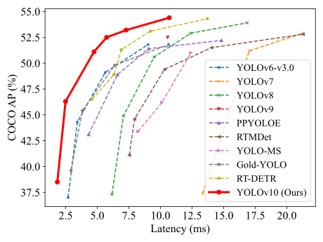

# [YOLOv10:Image Forged Check](https://arxiv.org/abs/2405.14458)


Official PyTorch implementation of **YOLOv10**.

<p align="center">
  
   <br>
  Comparisons with others in terms of latency-accuracy (left) and size-accuracy (right) trade-offs.
</p>

[YOLOv10: Real-Time End-to-End Object Detection](https://arxiv.org/abs/2405.14458).\
Ao Wang, Hui Chen, Lihao Liu, Kai Chen, Zijia Lin, Jungong Han, and Guiguang Ding\
[](https://arxiv.org/abs/2405.14458) <a href="https://colab.research.google.com/github/roboflow-ai/notebooks/blob/main/notebooks/train-yolov10-object-detection-on-custom-dataset.ipynb#scrollTo=SaKTSzSWnG7s"></a> [](https://huggingface.co/collections/jameslahm/yolov10-665b0d90b0b5bb85129460c2) [](https://huggingface.co/spaces/jameslahm/YOLOv10)  [](https://huggingface.co/spaces/kadirnar/Yolov10)  [](https://huggingface.co/spaces/Xenova/yolov10-web) [](https://learnopencv.com/yolov10/) [](https://openbayes.com/console/public/tutorials/im29uYrnIoz) 


<details>
  <summary>
  <font size="+1">Abstract</font>
  </summary>
Over the past years, YOLOs have emerged as the predominant paradigm in the field of real-time object detection owing to their effective balance between computational cost and detection performance. Researchers have explored the architectural designs, optimization objectives, data augmentation strategies, and others for YOLOs, achieving notable progress. However, the reliance on the non-maximum suppression (NMS) for post-processing hampers the end-to-end deployment of YOLOs and adversely impacts the inference latency. Besides, the design of various components in YOLOs lacks the comprehensive and thorough inspection, resulting in noticeable computational redundancy and limiting the model's capability. It renders the suboptimal efficiency, along with considerable potential for performance improvements. In this work, we aim to further advance the performance-efficiency boundary of YOLOs from both the post-processing and the model architecture. To this end, we first present the consistent dual assignments for NMS-free training of YOLOs, which brings the competitive performance and low inference latency simultaneously. Moreover, we introduce the holistic efficiency-accuracy driven model design strategy for YOLOs. We comprehensively optimize various components of YOLOs from both the efficiency and accuracy perspectives, which greatly reduces the computational overhead and enhances the capability. The outcome of our effort is a new generation of YOLO series for real-time end-to-end object detection, dubbed YOLOv10. Extensive experiments show that YOLOv10 achieves the state-of-the-art performance and efficiency across various model scales. For example, our YOLOv10-S is 1.8$\times$ faster than RT-DETR-R18 under the similar AP on COCO, meanwhile enjoying 2.8$\times$ smaller number of parameters and FLOPs. Compared with YOLOv9-C, YOLOv10-B has 46\% less latency and 25\% fewer parameters for the same performance.
</details>

## Notes
- 2024/05/31: Please use the [exported format](https://github.com/THU-MIG/yolov10?tab=readme-ov-file#export) for benchmark. In the non-exported format, e.g., pytorch, the speed of YOLOv10 is biased because the unnecessary `cv2` and `cv3` operations in the `v10Detect` are executed during inference.
- 2024/05/30: We provide [some clarifications and suggestions](https://github.com/THU-MIG/yolov10/issues/136) for detecting smaller objects or objects in the distance with YOLOv10. Thanks to [SkalskiP](https://github.com/SkalskiP)!
- 2024/05/27: We have updated the [checkpoints](https://huggingface.co/collections/jameslahm/yolov10-665b0d90b0b5bb85129460c2) with class names, for ease of use.

## UPDATES 🔥
- 2024/06/01: Thanks to [ErlanggaYudiPradana](https://github.com/rlggyp) for the integration with [C++ | OpenVINO | OpenCV](https://github.com/rlggyp/YOLOv10-OpenVINO-CPP-Inference)
- 2024/06/01: Thanks to [NielsRogge](https://github.com/NielsRogge) and [AK](https://x.com/_akhaliq) for hosting the models on the HuggingFace Hub!
- 2024/05/31: Build [yolov10-jetson](https://github.com/Seeed-Projects/jetson-examples/blob/main/reComputer/scripts/yolov10/README.md) docker image by [youjiang](https://github.com/yuyoujiang)!
- 2024/05/31: Thanks to [mohamedsamirx](https://github.com/mohamedsamirx) for the integration with [BoTSORT, DeepOCSORT, OCSORT, HybridSORT, ByteTrack, StrongSORT using BoxMOT library](https://colab.research.google.com/drive/1-QV2TNfqaMsh14w5VxieEyanugVBG14V?usp=sharing)!
- 2024/05/31: Thanks to [kaylorchen](https://github.com/kaylorchen) for the integration with [rk3588](https://github.com/kaylorchen/rk3588-yolo-demo)!
- 2024/05/30: Thanks to [eaidova](https://github.com/eaidova) for the integration with [OpenVINO™](https://github.com/openvinotoolkit/openvino_notebooks/blob/0ba3c0211bcd49aa860369feddffdf7273a73c64/notebooks/yolov10-optimization/yolov10-optimization.ipynb)!
- 2024/05/29: Add the gradio demo for running the models locally. Thanks to [AK](https://x.com/_akhaliq)!
- 2024/05/27: Thanks to [sujanshresstha](sujanshresstha) for the integration with [DeepSORT](https://github.com/sujanshresstha/YOLOv10_DeepSORT.git)!
- 2024/05/26: Thanks to [CVHub520](https://github.com/CVHub520) for the integration into [X-AnyLabeling](https://github.com/CVHub520/X-AnyLabeling)!
- 2024/05/26: Thanks to [DanielSarmiento04](https://github.com/DanielSarmiento04) for integrate in [c++ | ONNX | OPENCV](https://github.com/DanielSarmiento04/yolov10cpp)!
- 2024/05/25: Add [Transformers.js demo](https://huggingface.co/spaces/Xenova/yolov10-web) and onnx weights(yolov10[n](https://huggingface.co/onnx-community/yolov10n)/[s](https://huggingface.co/onnx-community/yolov10s)/[m](https://huggingface.co/onnx-community/yolov10m)/[b](https://huggingface.co/onnx-community/yolov10b)/[l](https://huggingface.co/onnx-community/yolov10l)/[x](https://huggingface.co/onnx-community/yolov10x)). Thanks to [xenova](https://github.com/xenova)!
- 2024/05/25: Add [colab demo](https://colab.research.google.com/github/roboflow-ai/notebooks/blob/main/notebooks/train-yolov10-object-detection-on-custom-dataset.ipynb#scrollTo=SaKTSzSWnG7s), [HuggingFace Demo](https://huggingface.co/spaces/kadirnar/Yolov10), and [HuggingFace Model Page](https://huggingface.co/kadirnar/Yolov10). Thanks to [SkalskiP](https://github.com/SkalskiP) and [kadirnar](https://github.com/kadirnar)! 

## Performance
Custom Data set

| Model | Test Size | #Params | FLOPs | AP<sup>val</sup> | Latency |
|:---------------|:----:|:---:|:--:|:--:|:--:|
| [YOLOv10-N](https://huggingface.co/jameslahm/yolov10n) |   640  |     2.3M    |   6.7G   |     38.5%     | 1.84ms |
| [YOLOv10-S](https://huggingface.co/jameslahm/yolov10s) |   640  |     7.2M    |   21.6G  |     46.3%     | 2.49ms |
| [YOLOv10-M](https://huggingface.co/jameslahm/yolov10m) |   640  |     15.4M   |   59.1G  |     51.1%     | 4.74ms |
| [YOLOv10-B](https://huggingface.co/jameslahm/yolov10b) |   640  |     19.1M   |  92.0G |     52.5%     | 5.74ms |
| [YOLOv10-L](https://huggingface.co/jameslahm/yolov10l) |   640  |     24.4M   |  120.3G   |     53.2%     | 7.28ms |
| [YOLOv10-X](https://huggingface.co/jameslahm/yolov10x) |   640  |     29.5M    |   160.4G   |     54.4%     | 10.70ms |

## GETTING STARTED - INSTALL
## -> PREREQUISITES
clone project    
    Microsoft VS Code (Optional):
            • Purpose: VS Code is a popular integrated development environment (IDE) that provides a user-friendly interface for coding and project management.
            • Usage: While optional, VS Code offers features like syntax highlighting, debugging capabilities, and integration with Git that can enhance development productivity.
    Python:
            • Purpose: Python is required as it serves as the programming language for developing and running the YOLOv10 model and associated scripts.
            • Version Requirement: The specified version requirement is Python 3.0.1 or greater, ensuring compatibility with the required libraries and dependencies for YOLOv10.
    Dataset:
            • Purpose: The dataset consists of images used to train the YOLOv10 model.
            • Importance: The quality and quantity of data directly impact the accuracy and performance of the trained model. More diverse and representative data leads to better 
               generalization and detection capabilities.
## Demo
```
python main.py
```

MAKE DATASET WITH ROBOFLOW
           You can experiment with any custom project on Roboflow Universe, create your own datasets, and even use RF100 datasets sponsored by Intel. Or export dataset file in your desire yolo 
              version
 PREPARE YOUR DATASET:
           Collect a dataset of images containing both fake and real images.Organize these images into a folder structure for easy access.
 UPLOAD TO ROBOFLOW:
          Go to the Roboflow website and sign in or create an account.Create a new project in Roboflow and choose the object detection template.Upload your folder containing the images to the 
           project.
 CREATE CLASSES:
          Define two classes: fake and real.Roboflow will prompt you to create these classes during the project setup.
 ANNOTATE IMAGES:
          For each image in your dataset, annotate whether the image is fake or real.If an image is fake, highlight and annotate the specific parts of the image that are fake.Use Roboflow’s                     annotation tools to draw bounding boxes around these areas and label them accordingly.
 EXPORT DATA:
          Once all images are annotated, go to the export section in Roboflow.Choose the appropriate format for your annotations (e.g., YOLO, COCO).Download the exported dataset, which will                    include the images and their annotations. Or use Roboflow API
          ```python
          !pip install -q roboflow 
          from roboflow import Roboflow 
          rf = Roboflow(api_key="your-api-key") 
          project = rf.workspace("vladutc").project("x-ray-baggage") 
          version = project.version(3) 
          dataset = version.download("yolov8")
            ```
          The exported data includes a data.yaml file, which specifies the license to Roboflow and the folder paths containing the dataset's annotated images. This file is crucial for configuring              the dataset for model training, ensuring all images and their annotations are correctly referenced.
Or
```python
from ultralytics import YOLOv10

model = YOLOv10.from_pretrained('jameslahm/yolov10{n/s/m/b/l/x}')
# or
# wget https://github.com/THU-MIG/yolov10/releases/download/v1.1/yolov10{n/s/m/b/l/x}.pt
model = YOLOv10('yolov10{n/s/m/b/l/x}.pt')

model.val(data='coco.yaml', batch=256)
```


## Training 
```
!yolo task=detect mode=train batch=32 plots=true model='./weights/yolov10n.pt' data='D:\Saqib\IdentifyModifiedImage\Mycode\MLSource\yolov10-main\ImageForensic\data.yaml'
```

After the model training is complete, run the labels_correlogram to verify the results:
```python
import cv2
import supervision as sv
image = cv2.imread('./runs/detect/train/labels_correlogram.jpg')
results = model(image)[0]
sv.plot_image(image)
```

## TESTING SOLUTION

REQUIRED LIBRUARIES:
   • cv2: OpenCV library for image processing.
   • supervision: A library (hypothetical in this context) for managing detections and annotations.
   • ultralytics: Contains the YOLOv10 model for object detection.
Loads the YOLOv10 model using the weights obtained from training (best.pt).
model = YOLOv10('./runs/detect/train/weights/best.pt')
Reads the image located at the specified path. This is the image on which object detection will be performed.
```python
image = cv2.imread('Image path’)
scores.results = model(image)[0]
detections = sv.Detections.from_ultralytics(results)
print(detections)
bounding_box_annotator = sv.BoundingBoxAnnotator()
label_annotator = sv.LabelAnnotator()
annotated_image=bounding_box_annotator.annotate(scene=image,
detections=detections)
annotated_image=label_annotator.annotate(scene=annotated_image,
detections=detections)
sv.plot_image(annotated_image)
```

## CREATING Flask API
• Flask: Framework for building web applications in Python.
• request: Allows handling of incoming HTTP requests.
• jsonify: Converts Python dictionaries to JSON format for HTTP responses.
• cv2: OpenCV library for computer vision tasks.
• supervision as sv: Custom module (supervision) for handling annotations and detections.
• YOLOv10 from ultralytics: A specific object detection model used for this task.
• base64, numpy: Python libraries for handling base64 encoding/decoding and numerical operations.
```
try:
        app.logger.info("Received POST request")
        data = request.get_json()
        if not data:
            app.logger.error("Invalid or missing JSON body")
            return jsonify({"error": "Invalid or missing JSON body"}), 400

        if 'base64String' not in data:
            app.logger.error("Missing base64String")
            return jsonify({"error": "Missing base64String"}), 400

        base64_string = data['base64String']
        app.logger.info(f"Received base64 string of length {len(base64_string)}")

        image_data = base64.b64decode(base64_string)
        nparr = np.frombuffer(image_data, np.uint8)
        image = cv2.imdecode(nparr, cv2.IMREAD_COLOR)
        image1 = Image.open(BytesIO(image_data))
        path = './runs/detect/train5/weights/last.pt'
        model = YOLOv10(path)
        results = model(image)[0]
        detections = sv.Detections.from_ultralytics(results)

        # Annotate the image
        bounding_box_annotator = sv.BoxAnnotator()
        label_annotator = sv.LabelAnnotator()
        annotated_image = bounding_box_annotator.annotate(scene=image, detections=detections)
        annotated_image = label_annotator.annotate(scene=annotated_image, detections=detections)
        _, buffer = cv2.imencode('.png', annotated_image)
        encoded_string = base64.b64encode(buffer).decode('utf-8')
        # GET_RESULT_STRING(image,model)
        app.logger.info("Image processed and encoded successfully")
        return jsonify({"image": encoded_string,"detection_result":detections.data['class_name'].tolist()[1]})

    except Exception as e:
        app.logger.error(f"Error occurred: {str(e)}")
        return jsonify({"error": str(e)}), 500
```


## Acknowledgement

The code base is built with [ultralytics](https://github.com/ultralytics/ultralytics) and [RT-DETR](https://github.com/lyuwenyu/RT-DETR).

Thanks for the great implementations! 

## Citation

If our code or models help your work, please cite our paper:
```BibTeX
@article{wang2024yolov10,
  title={YOLOv10: Real-Time End-to-End Object Detection},
  author={Wang, Ao and Chen, Hui and Liu, Lihao and Chen, Kai and Lin, Zijia and Han, Jungong and Ding, Guiguang},
  journal={arXiv preprint arXiv:2405.14458},
  year={2024}
}
```
